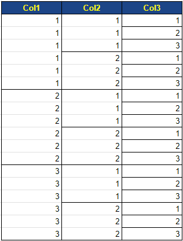
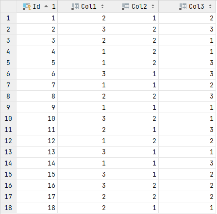

# Универсальная сортировка

Источник: [The power of Entity Framework Core and LINQ Expression Tree combined](https://medium.com/@erickgallani/the-power-of-entity-framework-core-and-linq-expression-tree-combined-6b0d72cf41db)

Для проверки используется таблица базы данных **Cols**.  
Если эту таблицу упорядочить по возрастанию по всем колонкам, то выглядеть она будет так:



но в базу данных записи были внесены в хаотичном порядке:



Потестировать сортировку можно
запустив [класс Program](https://github.com/gonzobard777/c_sharp_SortCheck/blob/master/ConsoleApp/Program.cs#L10)

## Варианты реализации

### 1. Направление сортировки определяется значением перечисления `SortDirection`

Это вариант из статьи, в которой расписан подход универсальной сортировки.  
[Ссылка](https://github.com/gonzobard777/c_sharp_SortCheck/blob/master/ConsoleApp/Database/SortExt.cs)

### 2. Направление сортировки определяется булевым параметром `desc`

Этот вариант ориентирован на ситуацию, когда с клиента может прийти параметр `desc`:

- если передан `desc=true`, тогда сортировка по Убыванию
- если не передан параметр `desc`, либо передан `desc=false`, тогда сортировка по Возрастанию

[Ссылка](https://github.com/gonzobard777/c_sharp_SortCheck/blob/master/ConsoleApp/Database/Sort2Ext.cs)

# Другие примеры сортировок

Пример 1:

```csharp
public static IQueryable<T> OrderingHelper<T>(IQueryable<T> source, string propertyName, bool descending, bool anotherLevel)
{
    if (!string.IsNullOrEmpty(propertyName))
        try
        {
            ParameterExpression param = Expression.Parameter(typeof(T), string.Empty);
            MemberExpression property = Expression.PropertyOrField(param, propertyName);
            LambdaExpression sort = Expression.Lambda(property, param);

            MethodCallExpression call = Expression.Call(
                typeof(Queryable),
                (!anotherLevel ? "OrderBy" : "ThenBy") + (descending ? "Descending" : string.Empty),
                new[] { typeof(T), property.Type },
                source.Expression,
                Expression.Quote(sort));
            return (IQueryable<T>)source.Provider.CreateQuery<T>(call);
        }
        catch
        {
            return null;
        }

    return null;
}
```

Пример 2:

```csharp
public virtual MethodCallExpression GetOrderExpression(string field, string order, Expression expression)
{
    var typeOfT = typeof(T);
    var parameter = Expression.Parameter(typeOfT, "parameter");
    var propertyType = typeOfT.GetProperty(field).PropertyType;
    var propertyAccess = Expression.PropertyOrField(parameter, field);
    var orderExpression = Expression.Lambda(propertyAccess, parameter);

    return Expression.Call(typeof(Queryable), order, new[] { typeOfT, propertyType }, expression, Expression.Quote(orderExpression));
}

public virtual IQueryable<T> Order(IQueryable<T> query, string field, string desc)
{
    var order = desc == "desc" ? "OrderByDescending" : "OrderBy";
    var expression = GetOrderExpression(field, order, query.Expression);
    if (expression == null) return query;

    return query.Provider.CreateQuery<T>(expression);
}
```

# Поднятие и подключение к БД PostreSQL

1. Установить [докер](https://www.docker.com/)
2. В корне проекта лежит файл `docker-compose.yaml`
2. В терминале надо перейти в папку проекта и выполнить команду:

```shell
docker-compose up
```

3. Строка подключения к БД:

```
"host=127.0.0.1;port=6748;database=db;username=root;password=12345"
```